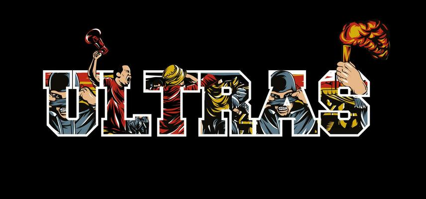

# Ultras World

## App Description
Ultras World is a web application dedicated to football fan culture, specifically focusing on ultras groups worldwide. Users can explore different ultras groups by country, learn about their history, view tifos (fan displays), and gain insights into the culture surrounding football fandom. The app was built to document and celebrate the passionate fan communities behind football teams.

## Getting Started
- **Deployed App:** [View Live](link-to-your-deployed-app)
- **Planning Materials:** [View Planning Documents](https://trello.com/b/2kbiUec1 ultras-world)
- **GITHUB Repository:** [Ultras Github]( https://github.com/pegasus1911/ultras)

## Technologies Used
- **Front-End:** HTML5, CSS3, JavaScript, Bootstrap
- **Back-End:** Django 5, PostgreSQL
- **Other Tools:** Git, GitHub, VS Code

## Next Steps
- Add user authentication for posting and commenting on tifos
- Enable image/video uploads for tifos
- Add search and filter functionality for ultras groups by country, year, or team
- Improve responsive design and mobile experience

